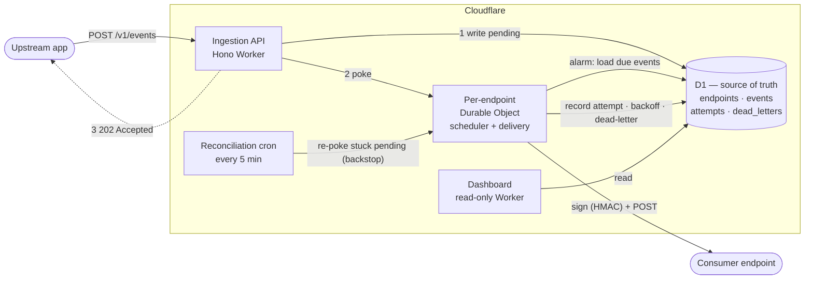
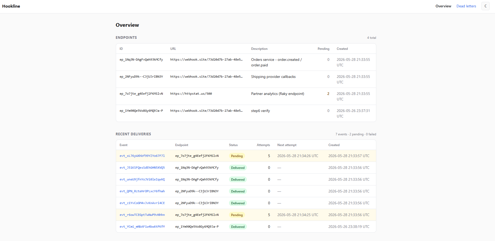
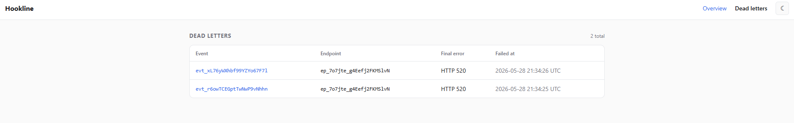

# Hookline

**Reliable webhook delivery as a service.** Applications POST it events; Hookline guarantees
delivery to consumer-registered HTTP endpoints with **at-least-once** semantics, **HMAC-signed**
payloads, **exponential backoff with jitter**, and a **dead-letter** path for exhausted retries.

It's the part that sits between "Stripe sent your server a `payment.succeeded` event" and your
server actually receiving it — signing, retries, failure isolation, and delivery bookkeeping.

[](https://github.com/BandonC/Hookline/actions/workflows/ci.yml)

Cloudflare-native, TypeScript end-to-end, and it runs at **$0/month** on free-tier primitives —
no managed queue. The delivery scheduler is built in-house on Durable Object alarms.

> This README is the tour. For the full design rationale — why these delivery semantics, why
> Durable Object alarms over Cloudflare Queues, the data model, and the v2 vision — see
> **[HOOKLINE.md](./HOOKLINE.md)**.

## Architecture



1. **Ingestion never blocks on delivery.** `POST /v1/events` validates, writes the event to D1 as
   `pending`, pokes the endpoint's Durable Object, and returns `202` immediately.
2. **The Durable Object is the scheduler *and* the delivery worker.** Its `alarm()` fires when a
   delivery is due, loads the due events from D1, signs each over `timestamp.body` (HMAC-SHA256),
   POSTs to the target, and records the attempt.
3. **Failures retry on a decorrelated-jitter backoff curve**, computed in code (no platform retry
   config). Events that exhaust their retries are marked `failed` and written to `dead_letters` —
   never silently dropped.
4. **A low-frequency cron is the at-least-once backstop**, re-poking any `pending` event whose
   delivery was somehow missed. Re-poking is idempotent.
5. **The dashboard is a separate read-only Worker** reading the same D1 — it never mutates state
   and never exposes signing secrets.

## Tech stack

| Layer | Tool |
| --- | --- |
| API routing | [Hono](https://hono.dev) on Cloudflare Workers |
| Scheduling + delivery | Durable Objects (SQLite-backed, free tier) |
| Store (source of truth) | Cloudflare D1 (SQLite) via [Drizzle](https://orm.drizzle.team) |
| Signing | HMAC-SHA256 (Web Crypto) |
| Dashboard | Next.js (App Router) via [OpenNext](https://opennext.js.org) on Workers |
| CI/CD | GitHub Actions |
| Packages | npm workspaces |

Everything sits within Cloudflare free tiers — **no Workers Paid plan required.**

## Repository layout

```
packages/
  api/        Ingestion API (Hono), the reconciliation cron, and the per-endpoint Durable Object
  dashboard/  Read-only observability UI (Next.js / OpenNext)
  db/         Drizzle schema, inferred types, and migrations (the single source of truth for the data model)
```

## Local development

```bash
npm install

# API Worker (wrangler dev) — needs packages/api/.dev.vars (see .dev.vars.example)
npm run dev:api

# Apply the schema to your local D1
npm run db:migrate:local

# Dashboard (next dev) — needs packages/dashboard/.dev.vars (see .dev.vars.example)
npm run dev:dashboard
```

Secrets are never committed. Copy each package's `.dev.vars.example` to `.dev.vars` and fill it in:
the API needs `ADMIN_API_KEY`; the dashboard needs `DASHBOARD_BASIC_AUTH` (a `user:password` string).

## API usage

The endpoint-management routes are gated by `ADMIN_API_KEY` (`Authorization: Bearer …`). Event
ingestion is intentionally **not** gated.

```bash
# 1. Register a receiver. The signing secret is returned ONCE — store it.
curl -X POST https://<api-host>/v1/endpoints \
  -H "Authorization: Bearer $ADMIN_API_KEY" \
  -H "Content-Type: application/json" \
  -d '{"url":"https://your-receiver.example/hook","description":"orders"}'
# -> 201 { "id": "ep_…", "signing_secret": "whsec_…", ... }

# 2. Ingest an event for that endpoint.
curl -X POST https://<api-host>/v1/events \
  -H "Content-Type: application/json" \
  -d '{"endpoint_id":"ep_…","payload":{"type":"order.created","id":123}}'
# -> 202 { "id": "evt_…", "status": "pending", ... }
```

Hookline then delivers to the receiver with these headers, and the event ID lives **inside** the
signed body:

```
X-Hookline-Timestamp: <unix seconds>
X-Hookline-Signature: v1=<hex>     # HMAC-SHA256 over `${timestamp}.${rawBody}`
X-Hookline-Event-Id: evt_…         # convenience only — authority is the id in the signed body
```

Receivers verify by recomputing the signature over `timestamp.body` with their `signing_secret`,
and dedupe on the event ID (delivery is at-least-once).

## Dashboard

A read-only view of endpoints, recent deliveries, per-event attempt history, and dead-lettered
events. It's gated by HTTP Basic Auth and never surfaces signing secrets.



The Dead Letters page surfaces events that exhausted retries — at-least-once means they
land here rather than being silently dropped.



## Deployment

Two Workers (`hookline-api`, `hookline-dashboard`) on a shared remote D1.

- **PRs** run checks only: typecheck, tests (incl. a real-D1 reconciliation test), and a build of
  both Workers.
- **Merging to `main`** applies remote D1 migrations, then deploys both Workers — see
  [`.github/workflows/ci.yml`](./.github/workflows/ci.yml).

Manual deploy:

```bash
npm run db:migrate:remote                 # apply migrations to remote D1
npm run deploy:api                        # deploy the API Worker (carries the DO migration + cron)
npm run deploy -w @hookline/dashboard     # build + deploy the dashboard Worker
```

Production secrets are set with `wrangler secret put` (`ADMIN_API_KEY` on the API, `DASHBOARD_BASIC_AUTH`
on the dashboard); per-endpoint signing secrets are generated at runtime and stored in D1 — there is
no global signing secret.
