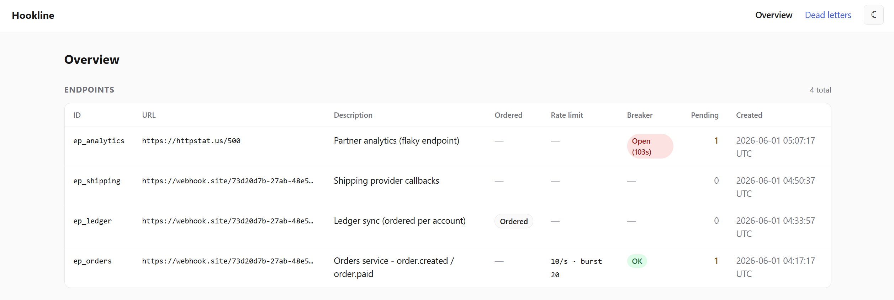
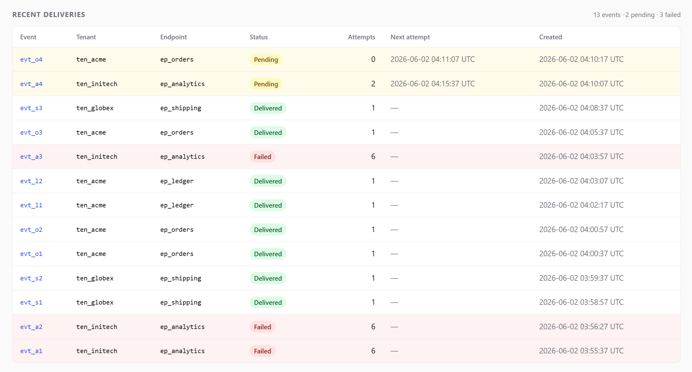

# Hookline

**Reliable webhook delivery as a service.** Applications POST it events; Hookline guarantees
delivery to consumer-registered HTTP endpoints with **at-least-once** semantics, **HMAC-signed**
payloads, **exponential backoff with jitter**, and a **dead-letter** path for exhausted retries.

It's the part that sits between "Stripe sent your server a `payment.succeeded` event" and your
server actually receiving it — signing, retries, failure isolation, and delivery bookkeeping.

[](https://github.com/BandonC/Hookline/actions/workflows/ci.yml)

**[Live dashboard](https://hookline-dashboard.bandon.workers.dev)** — read-only, no login (seeded demo data).

Cloudflare-native, TypeScript end-to-end, and it runs at **$0/month** on free-tier primitives —
no managed queue. The delivery scheduler is built in-house on Durable Object alarms.

> This README is the tour. For the full design rationale — why these delivery semantics, why
> Durable Object alarms over Cloudflare Queues, the data model, and the decision log behind each
> reliability feature — see **[HOOKLINE.md](./HOOKLINE.md)**.

## What's in the box

Each of these is a real feature with its own state machine and tests — not a checklist.

- **At-least-once delivery** with an explicit dead-letter path for events that exhaust retries. No silent drops.
- **HMAC-SHA256 signed payloads** over `timestamp.body`. The event ID lives inside the signed body, not in an unsigned header.
- **Decorrelated-jitter retry backoff** computed in code (1 s base, 1 h cap), not platform retry config.
- **Per-endpoint circuit breaker** — `closed → open → half_open` state machine on a rolling-window failure rate. CAS-arbitrated half-open trial, so only one DO at a time tests a recovering receiver.
- **Per-endpoint rate limiting** — token-bucket gate on outbound delivery; defer-not-drop, so Hookline never floods a receiver beyond its configured capacity.
- **Opt-in ordered delivery** — events sharing `(endpoint, ordering_key)` deliver serialized in `created_at` order via consistent hashing onto K=16 sub-DOs. Head-of-line blocking is strictly **per key**: a stuck key doesn't block any other.
- **Per-tenant fair scheduling** — a single coordinator Durable Object gates every delivery on weighted credits + slot caps, so one noisy tenant can't monopolize shared Cloudflare capacity and starve quiet ones.
- **Read-only dashboard** — endpoints with pending counts and breaker state, recent deliveries per tenant, per-event attempt history, and a dead-letter view.

## Architecture


1. **Ingestion never blocks on delivery.** `POST /v1/events` validates, writes the event to D1 as
   `pending`, pokes the endpoint's Durable Object, and returns `202` immediately.
2. **The Durable Object is the scheduler *and* the delivery worker.** Its `alarm()` fires when a
   delivery is due, loads the due events from D1, signs each over `timestamp.body` (HMAC-SHA256),
   POSTs to the target, and records the attempt.
3. **Failures retry on a decorrelated-jitter backoff curve**, computed in code (no platform retry
   config). Events that exhaust their retries are marked `failed` and written to `dead_letters` —
   never silently dropped.
4. **A low-frequency cron is the at-least-once backstop**, re-poking any `pending` event whose
   delivery was somehow missed. Re-poking is idempotent.
5. **The dashboard is a separate read-only Worker** reading the same D1 — it never mutates state
   and never exposes signing secrets.

## Tech stack

| Layer | Tool |
| --- | --- |
| API routing | [Hono](https://hono.dev) on Cloudflare Workers |
| Scheduling + delivery | Durable Objects (SQLite-backed, free tier) |
| Store (source of truth) | Cloudflare D1 (SQLite) via [Drizzle](https://orm.drizzle.team) |
| Signing | HMAC-SHA256 (Web Crypto) |
| Dashboard | Next.js (App Router) via [OpenNext](https://opennext.js.org) on Workers |
| CI/CD | GitHub Actions |
| Packages | npm workspaces |

Everything sits within Cloudflare free tiers — **no Workers Paid plan required.**

## Repository layout

```
packages/
  api/        Ingestion API (Hono), the reconciliation cron, and the per-endpoint Durable Object
  dashboard/  Read-only observability UI (Next.js / OpenNext)
  db/         Drizzle schema, inferred types, and migrations (the single source of truth for the data model)
```

## Local development

```bash
npm install

# API Worker (wrangler dev) — needs packages/api/.dev.vars (see .dev.vars.example)
npm run dev:api

# Apply the schema to your local D1
npm run db:migrate:local

# Dashboard (next dev) — needs packages/dashboard/.dev.vars (see .dev.vars.example)
npm run dev:dashboard
```

Secrets are never committed. Copy each package's `.dev.vars.example` to `.dev.vars` and fill it in:
the API needs `ADMIN_API_KEY`; the dashboard needs `DASHBOARD_BASIC_AUTH` (a `user:password` string).

## API usage

The endpoint and tenant routes are gated by `ADMIN_API_KEY` (`Authorization: Bearer …`). Event
ingestion is gated separately, by each endpoint's own `ingest_key` — the publisher presents it,
and it only authorizes publishing to that one endpoint. (The endpoint id is **not** a credential;
it appears in admin listings and the dashboard.) Registered receiver URLs must be `https`, and
request bodies are capped at 128 KB.

```bash
# 1. Create a tenant — the unit of fairness. weight is optional (default 1).
curl -X POST https://<api-host>/v1/tenants \
  -H "Authorization: Bearer $ADMIN_API_KEY" \
  -H "Content-Type: application/json" \
  -d '{"name":"acme","weight":5}'
# -> 201 { "id": "ten_…", "name": "acme", "weight": 5, ... }

# 2. Register a receiver under that tenant. signing_secret AND ingest_key are each
#    returned ONCE — store both. (signing_secret verifies origin; ingest_key publishes.)
curl -X POST https://<api-host>/v1/endpoints \
  -H "Authorization: Bearer $ADMIN_API_KEY" \
  -H "Content-Type: application/json" \
  -d '{"tenant_id":"ten_…","url":"https://your-receiver.example/hook","description":"orders"}'
# -> 201 { "id": "ep_…", "signing_secret": "whsec_…", "ingest_key": "ingk_…", ... }

# 3. Ingest an event for that endpoint — present the endpoint's ingest_key.
curl -X POST https://<api-host>/v1/events \
  -H "Authorization: Bearer $INGEST_KEY" \
  -H "Content-Type: application/json" \
  -d '{"endpoint_id":"ep_…","payload":{"type":"order.created","id":123}}'
# -> 202 { "id": "evt_…", "status": "pending", ... }

# Rotate an endpoint's signing secret (admin-only) if it leaks. Hard rotate: the old
# secret stops working immediately, so update the receiver's configured secret promptly.
curl -X POST https://<api-host>/v1/endpoints/ep_…/rotate-secret \
  -H "Authorization: Bearer $ADMIN_API_KEY"
# -> 200 { "id": "ep_…", "signing_secret": "whsec_…" }   # returned once

# Rotate an endpoint's ingest_key the same way (admin-only). Hard rotate: re-issue the
# new key to the publisher promptly.
curl -X POST https://<api-host>/v1/endpoints/ep_…/rotate-ingest-key \
  -H "Authorization: Bearer $ADMIN_API_KEY"
# -> 200 { "id": "ep_…", "ingest_key": "ingk_…" }        # returned once
```

Hookline then delivers to the receiver with these headers, and the event ID lives **inside** the
signed body:

```
X-Hookline-Timestamp: <unix seconds>
X-Hookline-Signature: v1=<hex>     # HMAC-SHA256 over `${timestamp}.${rawBody}`
X-Hookline-Event-Id: evt_…         # convenience only — authority is the id in the signed body
```

Receivers verify by recomputing the signature over `timestamp.body` with their `signing_secret`,
and dedupe on the event ID (delivery is at-least-once). For replay protection, reject deliveries
whose `X-Hookline-Timestamp` is outside a tolerance window (a few minutes — Stripe uses 5) before
trusting the payload; the timestamp is signed, so it can't be forged.

## Security model

- **Two credentials per endpoint, each shown once.** `signing_secret` lets the receiver verify a
  delivery came from Hookline; `ingest_key` lets a publisher submit events to that endpoint. They're
  separate on purpose — a leaked `ingest_key` can't forge signatures. Either can be rotated
  independently (`POST /v1/endpoints/:id/rotate-secret`, `…/rotate-ingest-key`), so remediating one
  doesn't disturb the other. Both are stored as-is in D1 (HMAC is symmetric — the secret can't be
  hashed); treat D1 access as access to every endpoint's credentials.
- **Tenants are a fairness unit, not a security boundary.** One `ADMIN_API_KEY` manages every tenant
  and endpoint; tenancy meters delivery capacity, it does not isolate ownership.
- **SSRF guard is registration-time and best-effort.** It blocks literal loopback/private/metadata
  addresses (including obfuscated IPv4 forms) and requires `https`, but cannot defend against DNS
  rebinding — the Workers `fetch` runtime exposes no way to resolve-and-pin. Endpoint registration is
  admin-gated, which bounds that exposure.
- **Public dashboard mode redacts response snippets.** With `DASHBOARD_PUBLIC=true` (the seeded demo)
  the Basic Auth gate is off, so per-attempt response snippets — which can carry receiver data — are
  redacted. Real deployments leave the gate on and see them.

## Dashboard

A read-only view of delivery state. It's gated by HTTP Basic Auth, reads the same D1 the API
writes, and never surfaces signing secrets.

The endpoints table shows each registered target with its per-endpoint config at a glance —
ordering, rate limit, and circuit-breaker state (here `ep_orders` runs a rate limit *and* a
breaker, while `ep_analytics` is tripped **Open** after failing). These features compose; an
endpoint can use any combination.



Recent deliveries are grouped by tenant, so you can see fair scheduling at work: a noisy tenant's
backlog doesn't push another tenant's events down the queue. Each row links to its full
per-attempt history.



The Dead Letters page surfaces events that exhausted their retries — at-least-once means they
land here with a final error rather than being silently dropped.


## Deployment

Two Workers (`hookline-api`, `hookline-dashboard`) on a shared remote D1.

- **PRs** run checks only: typecheck, tests (incl. a real-D1 reconciliation test), and a build of
  both Workers.
- **Merging to `main`** applies remote D1 migrations, then deploys both Workers — see
  [`.github/workflows/ci.yml`](./.github/workflows/ci.yml).

Manual deploy:

```bash
npm run db:migrate:remote                 # apply migrations to remote D1
npm run deploy:api                        # deploy the API Worker (carries the DO migration + cron)
npm run deploy -w @hookline/dashboard     # build + deploy the dashboard Worker
```

Production secrets are set with `wrangler secret put` (`ADMIN_API_KEY` on the API, `DASHBOARD_BASIC_AUTH`
on the dashboard); per-endpoint signing secrets are generated at runtime and stored in D1 — there is
no global signing secret.
